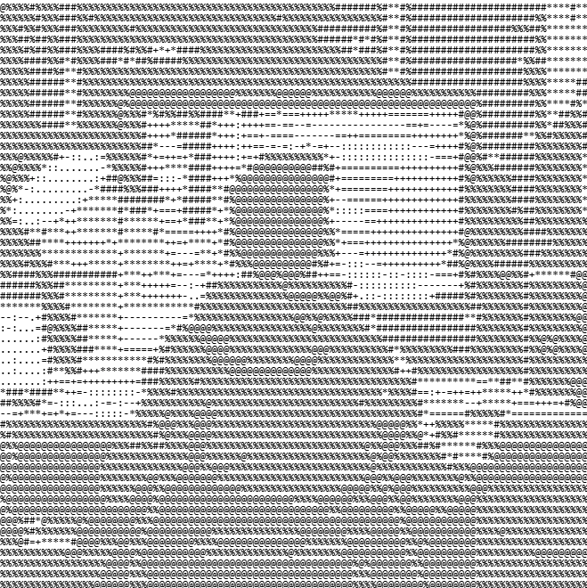

<!-- SHREENATH MEHTA | GitHub Profile README -->

<div align="center">

```
╔══════════════════════════════════════════════════════════════════════╗
║              S H R E E N A T H   M E H T A                           ║
║         Cybersecurity  •  Offensive Security  •  AI & Automation     ║
╚══════════════════════════════════════════════════════════════════════╝
```

</div>

---

<table>
<tr>
<td width="45%" valign="top">



</td>
<td width="55%" valign="top">

```
┌─────────────────────────────────────────┐
│  shreenath@github ~ $                   │
├─────────────────────────────────────────┤
│                                         │
│  shreenath@github                       │
│  ──────────────────────────             │
│  OS:       Windows 11 / Linux / Android │
│  Host:     SELF                         │
│  Shell:    Bash / PowerShell / Zsh      │
│  Role:     Web Pentester                │
│  Focus:    Offensive Security           │
│  Security: CTF · Web · API · OSINT      │
│  AI:       Privacy-first · Automation   │
│  Status:   ● Building & Learning        │
│                                         │
│  Languages:                             │
│  Python · JavaScript · HTML · CSS       │
│                                         │
│  Tools:                                 │
│  Burp Suite · Nmap · Wireshark          │
│                                         │
│  Interests:                             │
│  Pentesting · CTFs · AI Security        │
│   · Linux                               │
│                                         │
└─────────────────────────────────────────┘
```

</td>
</tr>
</table>

---

```bash
$ whoami
```

> B.Tech Computer Science Engineering student with a deep focus on cybersecurity and offensive security. I spend my time breaking things to understand how they work — participating in CTFs, studying web application vulnerabilities, building security-oriented tools, and exploring the intersection of AI and automation. My work spans from penetration testing and vulnerability research to building privacy-first AI systems and Linux-based infrastructure tools. I believe in learning through doing: if it runs, it can be broken; if it can be broken, it can be secured.

---

```bash
$ ./current-work
```

```
[+] Learning   →  Offensive Security / Web Application Pentesting
[+] Practicing →  CTF Challenges & Vulnerability Research
[+] Building   →  Privacy-first AI tools & Security automation
[+] Exploring  →  AI Security, API Security & Linux Internals
[+] Writing    →  Security notes, writeups & documentation
```

---

```bash
$ cat security.conf
```

```
Cybersecurity
├── Offensive Security
│   ├── Web Application Security
│   ├── API Security
│   └── Authentication & Authorization
├── Penetration Testing
├── CTF Competitions
├── Vulnerability Research
├── Cryptography
├── OSINT
└── Security Automation
```

---

```bash
$ ls -la projects/
```

```
drwxr-xr-x  projects/
│
├── [ONYX]                                          [ AI · Privacy ]
│   ├── Privacy-first, local-first AI assistant
│   ├── Runs entirely on-device — no cloud dependency
│   └── AI + automation pipeline
│
├── [FocusORM]                              [ AI · Productivity ]
│   ├── AI-powered student productivity & intelligence system
│   └── Tracks focus, tasks, and performance analytics
│
├── [CloudOps Monitor]                       [ Linux · Cloud · AWS ]
│   ├── Linux server monitoring dashboard
│   ├── Automated backup pipeline via Cron
│   └── AWS integration
│
├── [MediChain]                           [ Blockchain · Healthcare ]
│   ├── Blockchain-secured healthcare data platform
│   └── Decentralized patient record management
│
└── [VascoChat]                              [ Security · Comms ]
    └── Secure communication platform
```

---

```bash
$ cat achievements.log
```

```
[2026] SAS CTF 2026
       ├── Global Rank : #77
       └── India Rank  : #1

[2025] Nebula Nexus Hackathon
       ├── Prize  : 2nd Place
       └── Team   : ZERODAY CREW

[2025] Manipal University Jaipur — Hardware Exhibition
       └── Prize  : 2nd Place

[2025] VGU, Jaipur
       └── Prize  : Consolation Prize

[2026] BSides Jaipur 2026
       └── Event  : Conference Participation
```

---

```bash
$ cat experience.log
```

```
[INTERN] Research Internship
         Org    : AI Labs / Digital Hammerr
         Topic  : AI-Powered Healthcare Chatbots with
                  Blockchain-secured Patient Data Management

[INTERN] Grras Solution
         Topic  : Linux & AWS Cloud

[INTERN] Syntecxhub
         Topic  : Cybersecurity
```

---

```bash
$ cat roles.txt
```

```
[ROLE]  Udaan Aeromodelling Club
        └── Webmaster

[ROLE]  Freelancer
        └── Web Pentester
```

---

```bash
$ dpkg --list tech-stack
```

**Programming**


**Security & Systems**


**Development**


---

```bash
$ systemctl status github-stats
```

<div align="center">


</div>

---

```bash
$ ./connect
```

```
[+] GitHub   →  https://github.com/Shreenathmehta32
[+] LinkedIn →  https://www.linkedin.com/in/shreenath-mehta-b12880255/
[+] X        →  https://x.com/ShreeNm32
```

[](https://github.com/Shreenathmehta32)
[](https://www.linkedin.com/in/shreenath-mehta-b12880255/)
[](https://x.com/ShreeNm32)

---

```bash
$ whoami
shreenath

$ echo $MISSION
Build.  Break.  Understand.  Secure.

$ systemctl status shreenath
● shreenath.service — Cybersecurity Student & Builder
   Loaded: loaded (/etc/shreenath/profile)
   Active: ● active (running)
   Tasks:  CTF · Pentest · Build · Learn · Repeat
```

<div align="center">

```
╔══════════════════════════════════════════════╗
║   [shreenath@github ~]$ _                   ║
╚══════════════════════════════════════════════╝
```


</div>
